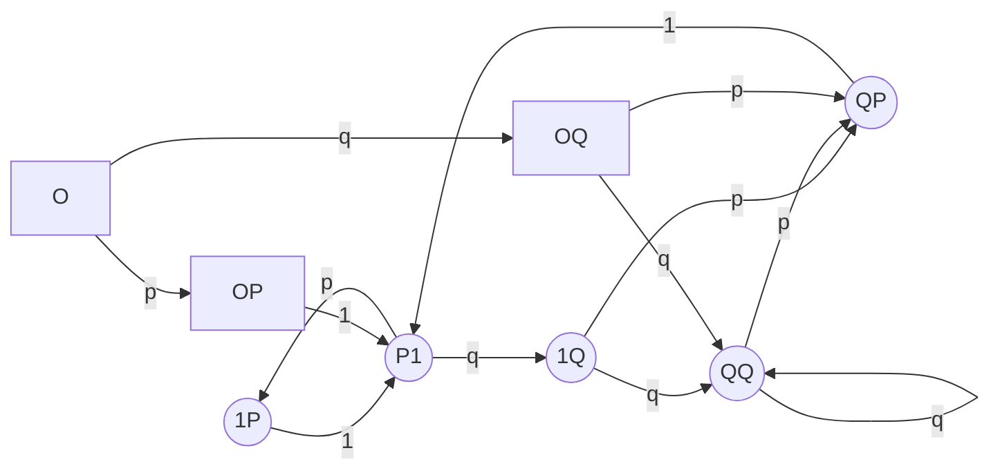
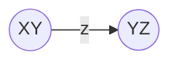
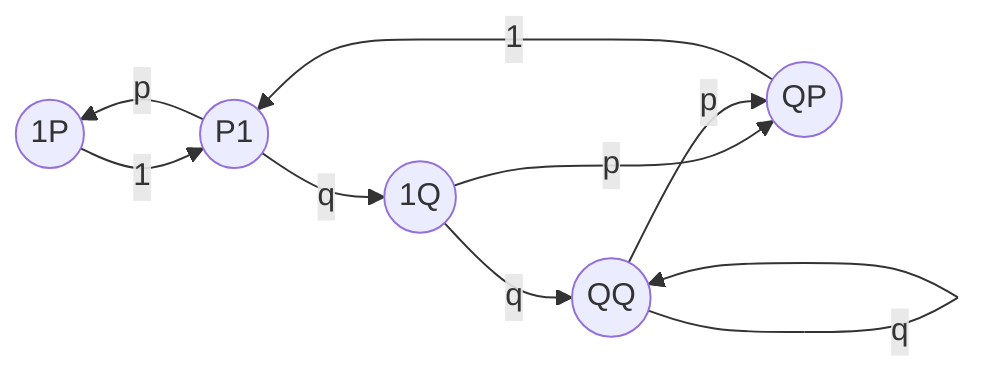

# Understanding swap unbiasing

## Understanding why we need to unbias the `swap` action

### Naive approach

A naive approach to swapping consecutive characters would be the following one:

```python
import random


def naive_swap_random_chars(text: str, p: float) -> str:
    char_list = list(text)
    for i in range(len(char_list) - 1):
        # Swap the current character with the next one with probability p
        if random.random() < p:
            char_list[i], char_list[i + 1] = char_list[i + 1], char_list[i]
    return "".join(char_list)
```

But the problem here is that one character can be swapped several time in a row, like the character `0` in the following example:

```pycon
>>> naive_swap_random_chars("0123456789", 0.25)
'1203457689'
```
In the worst case scenario, only the first character is swapped and "percolates" from the beginning to the end:

```pycon
>>> naive_swap_random_chars("0123456789", 1)
'1234567890'
```

This not what is expected when "swapping consecutive characters".

### Less Naive approach

To correct for this problem, we implement an approach that
_**prevents swapping the current character if it has already been swapped**_.

The function `naive_swap_random_chars` could be modified as following[^1]

```python hl_lines="6 9 11"
import random


def less_naive_swap_random_chars(text: str, p: float) -> str:
    char_list = list(text)
    swapped_indices = set()
    for i in range(len(char_list) - 1):
        if (random.random() < p and
            i not in swapped_indices):
            char_list[i], char_list[i + 1] = char_list[i + 1], char_list[i]
            swapped_indices.add(i + 1)
    return "".join(char_list)
```
Its behavior is consistent with what is expected: when given a probability of 1,
it swaps the first two letters, then the two following ones, and so on.
```pycon
>>> less_naive_swap_random_chars("0123456789", 1)
'1032547698'
```

[^1]: Our actual implementation is slightly different than this one.


Unfortunately (and contrary to the case of actions `delete`, `substitute` and `add`)
there is no easy link between the noise level given as input, and Character Error Rate of the output.

This is easily seen on the "calibration curve" of a `less_naive_swap_random_chars(text, p)` function,
giving the CER with respect to input noise level `p`:


This curve was obtained running `less_naive_swap_random_chars` on the string
`"abcdefghijklmnopqrstuvwxyzABCDEFGHIJKLMNOPQRSTUVWXYZ"` 10 000 times for every percent of noise level.
One can observe that it is not even monotonous, and that is does not reach 100%.

One "argument by hand-waving" explains why this function is not the identity, as for `delete`, `substitute` and `add`: preventing swapping the current character if it has already been swapped
introduces a correlation between two consecutive characters.
This makes the Central Limit Theorem irrelevant to compute Character Error Rate from the probability to swap a single character.

The actual approach we are using consists on getting the theoretical formula
of this relationship between Character Error Rate and noise level,
and plug it in the function that prevent swapping consecutive character `less_naive_swap_random_chars`.

```python
def consecutive_swap_random_chars(text: str, p: float) -> str:
    p = unbias.unbias_swap(p, len(text))
    return less_naive_swap_random_chars(text, p)
```

Let's study the impact of not swapping a character twice on the Character Error Rate!


## Modelization of the problem

### Character Error Rate as "normalized Levenshtein distance"

The [Character Error Rate](https://huggingface.co/spaces/evaluate-metric/cer) is the edit distance between two strings divided by the length of the reference string. In this case, the "edit distance" is the Levenshtein distance, that is

* **inserting** a random character, e.g.    STEAM -> ST<span style="background-color:LightBlue">R</span>EAM,
* **delete** a random character, e.g.        <span style="background-color:Crimson">S</span>TEAM  →  TEAM,
* **substituting** a random character, e.g. STEA<span style="background-color:LightGreen">M</span> -> STEA<span style="background-color:LightGreen">L</span>.

Another "argument by hand-waving" explains the presence of a bias:
swapping two (consecutive) characters is not _stricto sensu_ an "atomic action" for Levenshtein distance[^2].

We could claim that swapping two characters is equivalent to one deletion followed by one insertion, and that it should count as a distance of two. For example with
123<span style="background-color:Orange">45</span>678
↔
123<span style="background-color:Orange">54</span>678:

<p style="font-family: monospace;">
1<span style="background-color:Crimson">2</span>3 45678    <-- 1 deletion<br>
1 3<span style="background-color:LightBlue">2</span>45678    <-- 1 insertion<br>
</p>

But this claim does not always hold. For example, two swaps
123<span style="background-color:Orange">45</span> <span style="background-color:Orange">67</span>8
↔
123<span style="background-color:Orange">54</span> <span style="background-color:Orange">76</span>8
can be treated as only three "atomic" operations, instead of four as naively expected:

<p style="font-family: monospace;">
123<span style="background-color:Crimson">5</span>476 8    <-- 1 deletion<br>
123 4<span style="background-color:LightGreen">5</span>6 8    <-- 1 substitution<br>
123 456<span style="background-color:LightBlue">7</span>8    <-- 1 insertion<br>
</p>

However, this is only possible because the two swap operation are contiguous.

[^2]: Notice that the [Damerau-Levensthein distance](https://en.wikipedia.org/wiki/Damerau%E2%80%93Levenshtein_distance) **does** include `swap` as an atomic operation.
Using this distance instead of Levensthein makes the bias more simple to compute.
But the first "argument by hand-waving" still holds, so the result is not completely trivial.
This is beyond the scope of this library.

This observation[^3] leads us to the following result:

!!! quote "Contribution of individual swaps to total Levenshtein distance"
    For each character of the resulting string, there are three possibilities

    * The current character was not swapped:
    its contribution to the total Levenshtein distance is zero.
    * The current character was swapped, and the next-to-last[^4] one was not:
    its contribution to the total Levenshtein distance is two.
    This is the naive case of 123<span style="background-color:Orange">54</span>678,
    as well as the first swap of
    123<span style="background-color:Orange">54</span> <span style="background-color:Orange">76</span>8,
    or the two swaps of
    <span style="background-color:Orange">12</span>345<span style="background-color:Orange">67</span>8
    ↔
    <span style="background-color:Orange">21</span>345<span style="background-color:Orange">76</span>8

    * The current character was swapped, and the next-to-last[^4] one was also swapped:
    its contribution to the total Levenshtein distance is only one.
    This is the case of the second swap of
    123<span style="background-color:Orange">54</span> <span style="background-color:Orange">76</span>8.


[^3]: A formal proof can be given by induction with the [Wagner-Fischer algorithm](https://en.wikipedia.org/wiki/Wagner%E2%80%93Fischer_algorithm)

[^4]: In this case, the **last** character was **not** swapped, due to the aforementioned constraint preventing swapping the current character if it has already been swapped. That's why we have to look at the **next-to-last** character.

### Modelization of "swap" action using Markov Chain

As seen in the previous section, only the two last characters are useful to compute Character Error Rate.
So let's represent the process of iterating through a string and swapping characters
by a Markov Chain with states noted $XY$, where

* $X$ represents the status of previous swap transition,
* $Y$ represents the status of the current swap transition.

Those transitions are

* with probability $p$, "the swap was allowed, and effectively happened",
* with probability $q = 1-p$, "the swap was allowed, but did not happen",
* with probability $1$, "the swap was not allowed".

We represent the statuses as uppercase versions of the corresponding transition, so that $X$ and $Y$ can be $P$, $Q$ and $1$.
For the sake of completeness, we add a state $0$ (and the states $0P$ and $0Q$)
to represent the very beginning of the string, when there is no "previous swap".

The whole Markov Chain can be constructed by applying iteratively legal transitions from the state $0$, and is given below:


Some facts are worth checking:

* Every $1$ transition follows a $XP$ state
(i.e. "The only possibility **not** to have a choice is to directly follow a swap")
* Some states do not exists, like $11$
(i.e. "If the swap was not allowed, it is allowed again next iteration")
or $PQ$ and $PP$ (i.e. "No random is at play when the previous transition was a swap, the only possibility is not to swap").
* By construction, every arrow has the form



### Putting it together: computing probability of Levensthein distance

Let's order the states of our Markov Chain to get a basis $B = (1P, 1Q, P1, QP, QQ, 0P, 0Q, 0)$.

In this basis,

* the vector that represent the contribution of each state
to the total Levenshtein distance is $c = (1, 0, 0, 2, 0, 2, 0, 0)$,
* the probability distribution at start is the vector $\pi^{(0)} = (0, 0, 0, 0, 0, 0, 0, 1)$,
since we start from the starting state $0$ with a probability of one,
* and the transition matrix is

$$
P = \begin{pmatrix}
0 & 0 & 1 & 0 & 0 & 0 & 0 & 0\\
0 & 0 & 0 & p & q & 0 & 0 & 0\\
p & q & 0 & 0 & 0 & 0 & 0 & 0\\
0 & 0 & 1 & 0 & 0 & 0 & 0 & 0\\
0 & 0 & 0 & p & q & 0 & 0 & 0\\
0 & 0 & 1 & 0 & 0 & 0 & 0 & 0\\
0 & 0 & 0 & p & q & 0 & 0 & 0\\
0 & 0 & 0 & 0 & 0 & p & q & 0
\end{pmatrix}.
$$

After the $i$-th iteration, the probability distribution over the Markov Chain is given by
$\pi^{(i)} = \pi^{(0)} P^i$, and its expected contribution to Levenshtein distance is $c \pi^{(0)} P^i$.

Finally, the total expected Levenshtein distance for a string of length $N$ is[^5]

$$\mathtt{expected\_levenshtein} = \sum_{i=0}^{N-1} c \pi^{(0)} P^i $$

[^5]: in the actual implementation, a `for` loop is preferred over exponentiation of matrices for performance issues.

This quantity (up to the normalization factor $N$) is what is computed in the function `compute_expected_cer_from_noise_level`,
and is then inverted using scipy in the function `compute_noise_level_from_expected_cer`.
!!! tip "Result in the general case"
    **The `compute_noise_level_from_expected_cer` function is used to unbias the swap action.**

Notice that all of this is heavily cached to minimize computing.

### The special case of a very long string

For a very long string, the expected Character Error Rate does not depend on the length of the string, but only on the input probability $p$.

In other words, the stationary distribution hypothesis stands,
and the transitory states disappear:


With a truncated basis $B' = (1P, 1Q, P1, QP, QQ)$,
the "individual contribution to Levenshtein" vector becomes $c' = (1, 0, 0, 2, 0)$,
and the transition matrix is

$$
P' = \begin{pmatrix}
0 & 0 & 1 & 0 & 0\\
0 & 0 & 0 & p & q\\
p & q & 0 & 0 & 0\\
0 & 0 & 1 & 0 & 0\\
0 & 0 & 0 & p & q\\
\end{pmatrix}.
$$

Let $(x, y, z, t, u)$ be the components of $\pi$ in the basis $B'$.
The stationary distribution hypothesis allows us to write for the stationary distribution $\pi$:

$$\pi = \pi P', $$

that corresponds to the linear system

$$
\left\{
\begin{array}{l}
x = z \times p \\
y = z \times (1 - p) \\
z = x + t \\
t = (y + u) \times p \\
1 = x + y + z + u + t
\end{array}.
\right.
$$

The system is solved to find the value of $c' \times \pi^T = x + 2 \times t$:

$$\mathtt{expected\_cer} = \frac{2 \times p - p ^ 2}{p + 1}$$


This is exactly the curve we got experimentally with the "calibration curve" in the first section!

We then inverse this to feed the function `unbias_swap`, in the case where the number of characters is greater than 50:

!!! tip "Result in the special case of a very long string"
    $$ p = \frac{2 - \mathtt{expected\_cer}}{2} - \frac{\sqrt{(\mathtt{expected\_cer}^2) - (8 \times \mathtt{expected\_cer}) + 4}}{2} $$

As mentioned earlier, there is a maximum reachable in the Character Error Rate when applying only `swap` operations.
This maximum is directly due to the constraint of preventing swapping the current character if it has already been swapped.


## Taking into account repetitions of characters in natural language

In natural language, our assumption that two consecutive characters are always different is not always true.
To take this into account, we have to introduce a small multiplicative coefficient to the probability $p$.

For english language, we computed this correction factor to be approximately 1.0655, which is the default in `textnoisr`.


*[Character Error Rate]: (=CER) A metric that quantify how noisy is a text. It is number of insert, delete and substitute errors, divided by the total number of characters.
